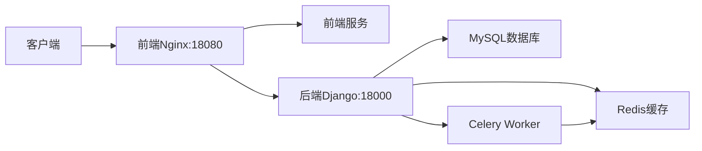
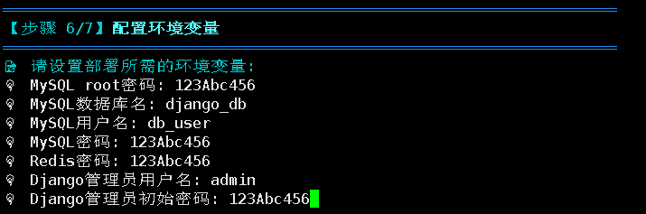

# MSDPS Deploy 🚀

[](https://ubuntu.com/)
[](https://www.docker.com/)
[](https://docs.docker.com/compose/)
[](https://www.python.org/)
[](https://redis.io/)
[](https://www.mysql.com/)

> 一个高度定制化的质谱数据处理系统部署工具，用于在Linux环境下快速部署完整的MSDPS的Web服务。

<br/>

## 🏗️ 服务架构



## 📑 目录

- [🏗️ 服务架构](#️-服务架构)
- [💻 系统要求](#-系统要求)
- [📁 目录结构](#-目录结构)
- [🚀 快速开始](#-快速开始)
- [📖 部署交互说明](#-部署交互说明)
  - [📥 拉取远程镜像](#-拉取所需远程镜像推荐方式)
    - [🌐 服务端口配置](#-1-服务端口配置)
    - [📦 镜像说明](#-2-镜像说明)
  - [🔄 本地构建镜像](#-本地构建所需镜像)
    - [📦 项目代码克隆](#-1-项目代码克隆)
    - [🌐 服务端口配置](#-2-服务端口配置)
    - [🔐 环境变量配置](#-3-环境变量配置)
- [⚠️ 注意事项](#️-注意事项)
  - [✅ 部署前检查](#-部署前请确保)
  - [🛡️ 安全建议](#️-安全建议)
- [⚡ Git加速配置（可选）](#git加速配置可选)

## 💻 系统要求

- Ubuntu服务器（推荐20.04）
- Docker和Docker Compose`（可选，脚本会自动安装）`
- Git

<div STYLE="page-break-after: always;"></div>

## 📁 目录结构

```tree
msdps_deploy/
├── configs/                        # 配置文件目录
│   ├── docker-compose-local.yml    # 本地构建Docker服务编排配置
│   ├── docker-compose-remote.yml   # 远程镜像Docker服务编排配置
│   ├── env/                        # 环境变量配置目录
│   │   ├── .env                    # Django基本环境变量
│   │   ├── .env.production         # Django生产环境变量
│   │   ├── mysql.env               # MySQL环境变量
│   │   └── redis.env               # Redis环境变量
│   ├── mysql/                      # MySQL配置目录
│   │   └── init.sql                # MySQL初始化脚本
│   ├── redis/                      # Redis配置目录
│   │   └── redis.conf              # Redis配置文件
│   ├── backend/                    # 后端服务配置目录
│   │   ├── Dockerfile              # 后端镜像构建文件
│   │   └── entrypoint.sh           # 后端容器启动时执行脚本
│   └── frontend/                   # 前端服务配置目录
│       ├── Dockerfile              # 前端镜像构建文件
│       └── nginx.conf              # Nginx配置文件
│       └── env.sh                  # 前端容器启动时执行脚本
├── scripts/                        # 部署脚本目录
│   └── Ubuntu/                     # Ubuntu专用脚本
│       ├── deploy.sh               # 部署脚本
│       ├── deploy-local.sh         # 本地构建部署脚本
│       ├── deploy-remote.sh        # 远程镜像部署脚本
│       ├── deploy-utils.sh         # 部署工具脚本
│       ├── docker-utils.sh         # Docker相关工具脚本
│       ├── git-utils.sh            # Git相关工具脚本
│       ├── django-utils.sh         # Django配置工具脚本
│       └── source-config.sh        # 系统镜像源配置脚本
├── static/                         # 静态资源目录
│   └── *.png                       # 文档相关图片
├── .gitignore                      # Git忽略配置文件
└── LICENSE                         # 项目许可证文件
```

## 🚀 快速开始

1. 克隆部署项目：
```bash
# 克隆项目
git clone https://github.com/whale-G/msdps_deploy.git
# 进入部署脚本所在目录
cd msdps_deploy/scripts/Ubuntu
# 赋予各脚本执行权限
chmod +x ./*.sh
```

2. 配置系统镜像源`（可选）`：
```bash
# 配置项：
# 1. apt下载镜像源为阿里云源
# 2. git加速
./source-config.sh
```

3. 启动一键部署脚本：
```bash
./deploy.sh
```

<div STYLE="page-break-after: always;"></div>

## 📖 部署交互说明

部署脚本提供两种部署方式：

1. 📦 拉取远程镜像（推荐）
   - 更快的部署速度
   - 稳定的预构建镜像
   - 无需本地构建环境

2. 🏗️ 本地构建镜像
   - 完全自定义的构建过程
   - 适合开发和调试
   - 需要更多时间和资源

### 📥 拉取所需远程镜像（推荐方式）

#### 🌐 1. 服务端口配置

首先，您需要配置Web服务的访问端口：


| 服务 | 默认端口 | 说明 |
|------|---------|------|
| 前端 | 18080 | 用于访问网站界面 |
| 后端 | 18000 | 用于API调用 |

> ⚠️ **重要提示**：
> - 这些端口将在服务器上对外开放
> - 直接按回车键将使用默认端口
> - 如需自定义，请确保输入的端口未被占用

#### 📦 2. 镜像说明
系统将拉取以下镜像：

| 镜像名称 | 版本 | 说明 |
|----------|------|------|
| msdps_frontend | v1 | 前端服务镜像 |
| msdps_backend | v1 | 后端服务镜像 |
| msdps_scheduler | v1 | 调度器服务镜像 |
| msdps_celery_worker | v1 | Celery工作节点镜像 |
| redis | 6.2 | Redis缓存服务镜像 |
| mysql | 8.0 | MySQL数据库服务镜像 |

> 📝 **注意事项**：
> - 镜像拉取可能需要几分钟时间，取决于网络状况
> - 首次拉取后会缓存在本地，后续部署将更快
> - 如遇拉取失败，脚本会自动重试

### 🔄 本地构建所需镜像

#### 📦 1. 项目代码克隆

首先，脚本会克隆前端和后端项目代码：


> 💡 **提示**：如果看到克隆相关的警告信息，且您确认这是首次部署，可以安全地忽略这些警告。

#### 🌐 2. 服务端口配置

接下来，您需要配置Web服务的访问端口：


| 服务 | 默认端口 | 说明 |
|------|---------|------|
| 前端 | 18080 | 用于访问网站界面 |
| 后端 | 18000 | 用于API调用 |

> ⚠️ **重要提示**：
> - 这些端口将在服务器上对外开放
> - 直接按回车键将使用默认端口
> - 如需自定义，请确保输入的端口未被占用

#### 🔐 3. 环境变量配置

接下来，您需要设置项目的核心环境变量：



| 配置项 | 用途 | 安全建议 |
|--------|------|----------|
| `MySQL root密码` | MySQL根用户密码 | 使用强密码 |
| `MySQL数据库名` | 项目专用数据库 | 避免使用常见名称 |
| `MySQL用户名` | 数据库访问账号 | 避免使用默认用户名 |
| `MySQL密码` | 数据库访问密码 | 使用强密码 |
| `Redis密码` | Redis访问凭证 | 使用强密码 |
| `Django管理员用户名` | 后台管理账号 | 避免使用admin |
| `Django管理员密码` | 后台管理密码 | 使用强密码 |

> 🛡️ **安全提示**：
> - 生产环境请使用高强度密码
> - 建议密码包含大小写字母、数字和特殊字符
> - 密码长度建议不少于8位
> - 请妥善保存所有配置信息

## ⚠️ 注意事项

### ✅ 部署前请确保：
   - 服务器防火墙已开放相应端口
   - 有足够的磁盘空间（建议 ≥ 10GB）
   - 已备份重要数据

### 🛡️ 安全建议

1. 密码管理
   - 部署完成后立即修改所有预设密码
   - 使用`change-passwords.sh`脚本进行安全的密码修改
   - 妥善保存新的密码信息

2. 端口安全
   - 仅开放必要的服务端口
   - 配置防火墙规则
   - 定期检查端口使用情况

## ⚡ Git加速配置（可选）

> 如果服务器可以正常访问Github，可以忽略

a. 备份hosts文件：
```bash
sudo cp /etc/hosts /etc/hosts.bak
```

b. 获取Github相关IP：
```bash
# 获取github.com的IP，请记录输出的IP地址
nslookup github.com

# 获取github.global.ssl.fastly.net的IP，请记录输出的IP地址
nslookup github.global.ssl.fastly.net
```

c. 配置hosts文件：
```bash
# 添加GitHub加速配置到hosts文件
# 请将下面的命令中的GITHUB_IP和GITHUB_FASTLY_IP替换为上一步获取到的实际IP地址
sudo bash -c 'cat << EOF >> /etc/hosts

# GitHub加速配置
GITHUB_FASTLY_IP github.global.ssl.fastly.net
GITHUB_FASTLY_IP http://github.global.ssl.fastly.net
GITHUB_FASTLY_IP https://github.global.ssl.fastly.net

GITHUB_IP github.com
GITHUB_IP http://github.com
GITHUB_IP https://github.com
EOF'
```

d. 刷新DNS缓存：
```bash
# 重启DNS服务
sudo systemctl restart systemd-resolved
```

e. 验证配置（可选）：
```bash
# 测试访问GitHub
ping github.com

# 如果ping成功，说明配置生效
```

> 注意：请确保将命令中的 `GITHUB_IP` 和 `GITHUB_FASTLY_IP` 替换为实际获取到的IP地址。